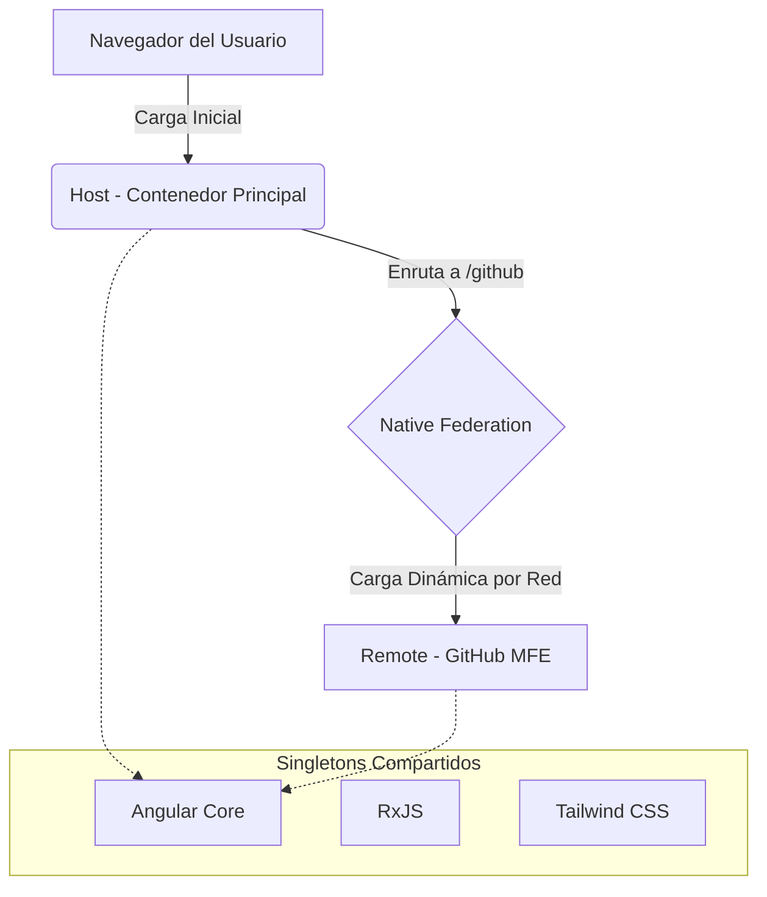
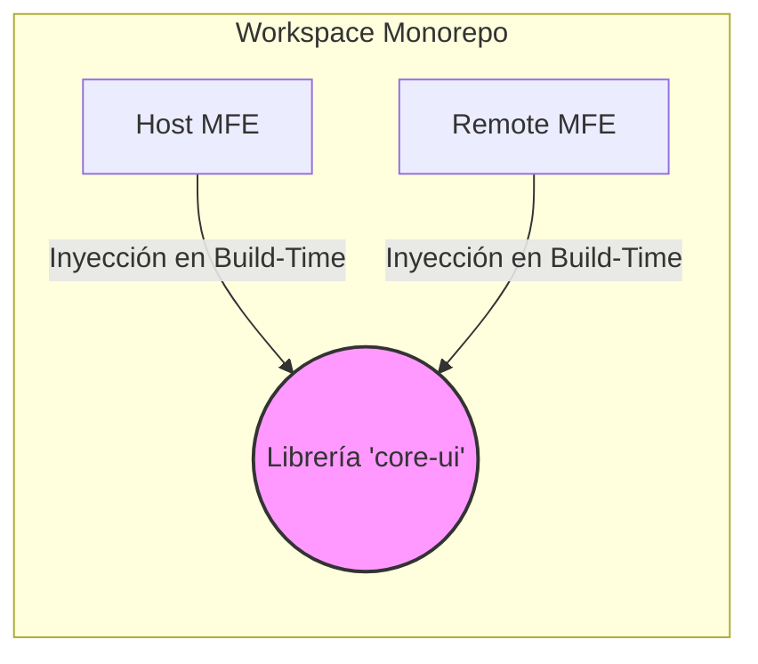
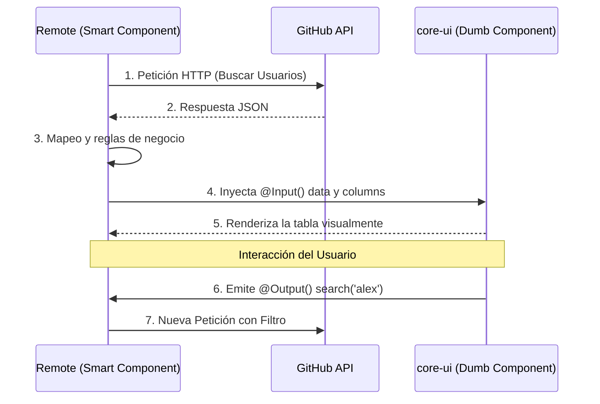
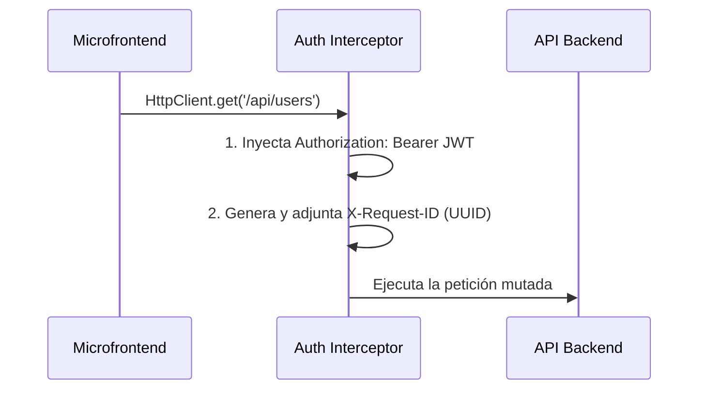

# Guía de Ejecución: Ecosistema Microfrontends

Este proyecto está configurado como un **Monorepo (Workspace) de Angular**. Esto significa que desde esta carpeta raíz se administran múltiples aplicaciones.

Actualmente, el ecosistema cuenta con dos aplicaciones:
1. **host** (Puerto 4200) - La aplicación base o contenedor principal.
2. **remote** (Puerto 4201) - El microfrontend que expone componentes/funcionalidades.

Ambos proyectos utilizan **Angular Native Federation** y **Tailwind CSS v4**.

---

## 🚀 Cómo ejecutar el proyecto en modo desarrollo

Para ver el ecosistema funcionando correctamente, necesitas tener ambos servidores ejecutándose simultáneamente. 

Ejecuta el siguiente comando maestro en la raíz de este proyecto (`/microfrontend`) para compilar y levantar simultáneamente el Host y todos los Microfrontends distribuidos:

```bash
npm run start:all
```

> 🌐 Podrás visualizar el ecosistema en tu navegador abriendo: **http://localhost:4200**
> 
> *Nota: Este script orquesta el levantamiento paralelo utilizando la librería `concurrently` y esquiva bloqueos por versiones de Node.js en Angular 22+.*

---

## 🏗️ Arquitectura: Del Alto al Bajo Nivel

El ecosistema sigue un patrón estricto basado en independizar dominios de negocio y reutilizar código UI mediante librerías internas, sin acoplar compilaciones ni despliegues.

### 1. Alto Nivel: Múltiples MFs y Módulos Federados
A nivel global, la arquitectura divide las responsabilidades de compilación y orquestación. **Module Federation solo se usa para cargar funcionalidades de negocio completas**, no para componentes visuales sueltos.



- **Independencia de despliegue:** `host` y `remote` tienen flujos de CI/CD completamente independientes. No existe acoplamiento de repositorios ni bloqueos en el lanzamiento de un release.
- **Exposición y Contrato Federado:** El Microfrontend expone su funcionalidad a través del archivo `remote/federation.config.js` mediante la propiedad `exposes` (ej. mapeando `./GithubProfiles` hacia su componente principal). El `host`, mediante su `app.routes.ts`, utiliza `loadRemoteModule` para descargar la aplicación de forma "Lazy Loaded" (bajo demanda) únicamente cuando el usuario accede a la ruta.
- **Restricción estricta:** No se deben crear dependencias directas de red entre MFs (ej. `host <--> remote` para un botón). Si un MFE necesita un componente UI, no debe pedirlo a otro MFE por red para evitar latencia, problemas de caché y puntos únicos de fallo.
- **Singletons:** Dependencias pesadas (`@angular/core`, `rxjs`, `tailwindcss`) están configuradas como `shared` en `federation.config.js` para cargarse una sola vez.

### 2. Nivel Medio: Librería Compartida (`core-ui`) en el Workspace
Para compartir la tabla y otros componentes complejos entre el `host` y los diferentes MFs, se utiliza una **librería interna estática** en el Monorepo. No se publica como librería NPM, ni como artefacto independiente, ni tiene pipeline propio.



- **Ubicación Física:** `projects/core-ui/`
- **Configuración TS (El Contrato de Consumo):** El archivo `tsconfig.json` raíz crea el alias `"core-ui"` apuntando directamente a `projects/core-ui/src/public-api.ts`.
- **Estrategia de compilación:** Cuando un MF (`remote` o `host`) requiere usar la tabla, importa este alias. Al construir el proyecto, el pipeline de compilación del MF en turno toma el código fuente de `core-ui` y **lo inyecta estáticamente en su propio bundle**.
```json
// tsconfig.json (Raíz)
{
  "compilerOptions": {
    "paths": {
      "core-ui": [
        "projects/core-ui/src/public-api.ts"
      ]
    }
  }
}
```

### 3. Bajo Nivel: Organización del Código y Contratos Agnosticos

A nivel de código, implementamos una separación estricta: **la UI jamás debe conocer la lógica de negocio ni el dominio de datos.**

#### 3.1. Librería `core-ui` (Dumb Components)
Ubicada en `projects/core-ui/src/lib/data-table/data-table.component.ts`. Es un componente standalone 100% agnóstico del dominio. Define contratos fuertes (interfaces) que dictan cómo los MFs deben interactuar con él:
```typescript
// Contrato base de la tabla (projects/core-ui/src/lib/...)
export interface CoreTableColumn {
  key: string;
  label: string;
}

@Component({
  selector: 'core-data-table',
  standalone: true,
  // ...
})
export class CoreDataTableComponent {
  // La tabla recibe la configuración, pero no sabe qué significa
  @Input() columns: CoreTableColumn[] = [];
  @Input() data: any[] = [];
  
  // Emite eventos hacia arriba para que el MF actúe
  @Output() search = new EventEmitter<string>();
}
```

#### 3.2. Consumo en los MFs (Smart Components)
El microfrontend (ej. `remote/src/app/github-profiles/`) conserva sus propios modelos (`GithubUser`), sus propios servicios inyectados (`GithubApiService`) y sus propias reglas de dominio y permisos. Su única relación con la tabla es inyectarle los datos formateados cumpliendo el contrato público.

Además, aplicamos una rígida **Separación de Responsabilidades (SoC)**. Ningún componente posee HTML en línea; todos están divididos en:
- `[nombre].component.ts`: Contiene la inyección de dependencias, mutación de Señales de Angular y la gestión de flujos asíncronos.
- `[nombre].component.html`: Contiene únicamente la vista, utilizando el *Control Flow* nativo (`@if`, `@for`) sin ensuciarse con lógica de negocio.



```html
<!-- remote/src/app/github-profiles/github-profiles.component.html -->
<core-data-table
  title="Usuarios de GitHub"
  [columns]="githubColumns"
  [data]="users"
  (search)="onSearch($event)">
</core-data-table>
```
*En el ejemplo superior, `CoreDataTableComponent` procesa el evento y renderiza las celdas, pero es ignorante de que está operando sobre "Usuarios de GitHub" o que consumió una API externa.*

#### 3.3. Testing Unitario Aislado (Jest Zoneless)
- **Aislamiento Absoluto:** La librería `core-ui` posee pruebas unitarias escritas en **Jest** (`data-table.component.spec.ts`) que validan las interacciones del DOM y la correcta emisión de los `@Input`/`@Output`. Nunca dependen de mocks de servicios de los MFs.
- **Simulación de Interacciones (Mocking):** Las pruebas de los *Smart Components* interceptan la red (`global.fetch` o interceptores HTTP) asegurando que el testing evalúe la integridad visual y reactiva sin ejecutar requests reales ni mutar datos en bases de datos externas.
- **Configuración Moderna:** Configuramos el ecosistema para correr en modo *Zoneless* (`jest-preset-angular/setup-env/zoneless`), aprovechando la arquitectura ultramoderna de Angular 18+ para hacer el testing extremadamente rápido (pasando múltiples suites completas en escasos milisegundos) y sin dependencias mágicas en el DOM.

---

## 🛠️ Notas importantes para el desarrollo

- **Tailwind CSS:** Para usar clases de Tailwind, simplemente añádelas en el HTML de los componentes de cualquiera de los dos proyectos. La compilación se hará automáticamente.
- **Federation Config:** 
  - Si deseas exponer un componente desde el `remote` hacia el exterior, debes declararlo en el archivo `remote/federation.config.js` dentro del bloque `exposes`.
  - El `host` detectará automáticamente el código expuesto si configuras las rutas correctamente.
- **Pruebas Unitarias:** Ejecuta `npm run test` para correr las pruebas locales de todo el ecosistema y librerías compartidas.

---

## 🔐 Seguridad y Autenticación: Microsoft Entra ID (Azure AD)

El ecosistema incorpora seguridad corporativa de primer nivel delegando la gestión de identidad a Microsoft Entra ID (anteriormente Azure Active Directory). La integración se logró mediante el uso de la librería oficial **Microsoft Authentication Library (MSAL)** en su última versión para entornos Standalone de Angular (`@azure/msal-angular` v3).

### 1. Alto Nivel: El Flujo de Autenticación
La aplicación abandona por completo el patrón antiguo e inseguro conocido como *Implicit Flow* (usado en el pasado por `adal-angular`) para dar paso al **OAuth 2.0 Authorization Code Flow con PKCE (Proof Key for Code Exchange)**.

1. **Popup Seguro:** Cuando el usuario hace clic en el botón de "Directorio Activo de Azure" dentro de la pantalla de login del Host, la aplicación invoca el método `loginPopup()` de MSAL. Esto abre una nueva ventana completamente asilada del DOM principal.
2. **Mitigación XSS:** Al usar un popup para ingresar credenciales en `login.microsoftonline.com`, evitamos ataques *Cross-Site Scripting (XSS)*, ya que nuestro ecosistema Angular nunca tiene acceso a lo que el usuario digita, ni puede observar el tráfico entre el usuario y los servidores de Microsoft.
3. **Manejo de Respuestas:** Si las credenciales son correctas, Microsoft redirecciona el Popup y MSAL se encarga de interceptar el JWT (JSON Web Token) validado de forma criptográfica, entregándoselo a nuestra aplicación sin exponer secretos.

### 2. Nivel Medio: Arquitectura y Trazabilidad de Peticiones
La integración de MSAL se inyecta directamente en el motor de Angular utilizando la API más moderna `MSAL_INSTANCE` en el archivo principal `app.config.ts`. Esto permite su compatibilidad total con Angular 15+ (Standalone Components).

#### Interceptor Funcional Global (`auth.interceptor.ts`)
Para asegurar que todo servicio backend sepa qué usuario está ejecutando cada acción, diseñamos un interceptor HTTP en el `host` que actúa como "aduana" para cada petición de red saliente:



**Trazabilidad Extrema:** Además del token de identidad de Azure, el interceptor invoca la función nativa criptográfica `crypto.randomUUID()` del navegador e inyecta la cabecera `X-Request-ID` a **cada solicitud**. Esto permite al equipo de infraestructura o Backend rastrear de forma unívoca el ciclo de vida completo de la petición a través de microservicios usando plataformas de observabilidad como Datadog, Kibana o Grafana.

### 3. Bajo Nivel: Manejo de Caché de Sesión
El almacenamiento de la sesión fue explícitamente configurado para utilizar `BrowserCacheLocation.SessionStorage` dentro de las opciones de `PublicClientApplication` en `app.config.ts`. 

- **Ventaja de Seguridad:** Esta decisión de bajo nivel asegura que cuando el usuario cierre la pestaña activa de su navegador, todos los tokens y rastros de sesión generados por Azure **se eliminen físicamente** de la memoria de la máquina local de manera inmediata. Es una exigencia fundamental en regulaciones de seguridad modernas (Compliance) para prevenir robo de sesiones en computadoras de uso compartido.
