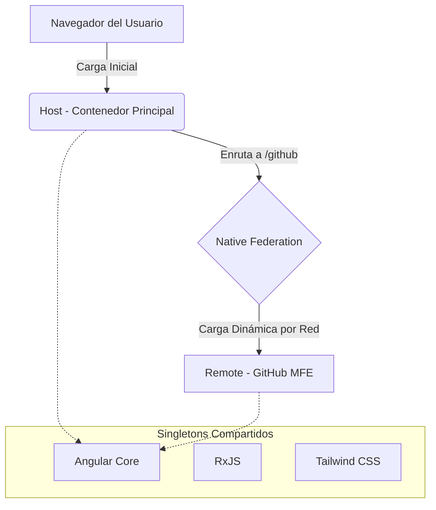
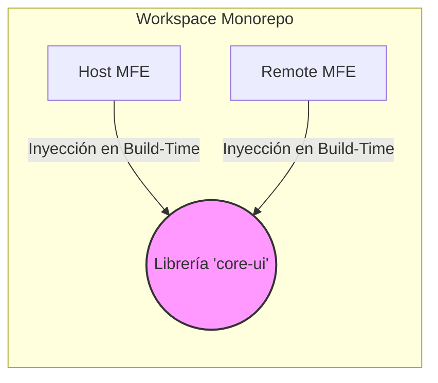
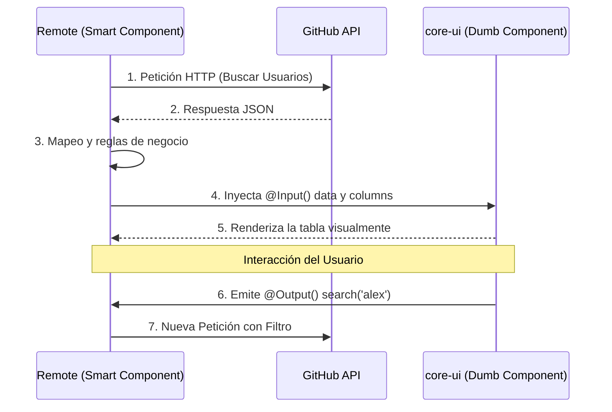
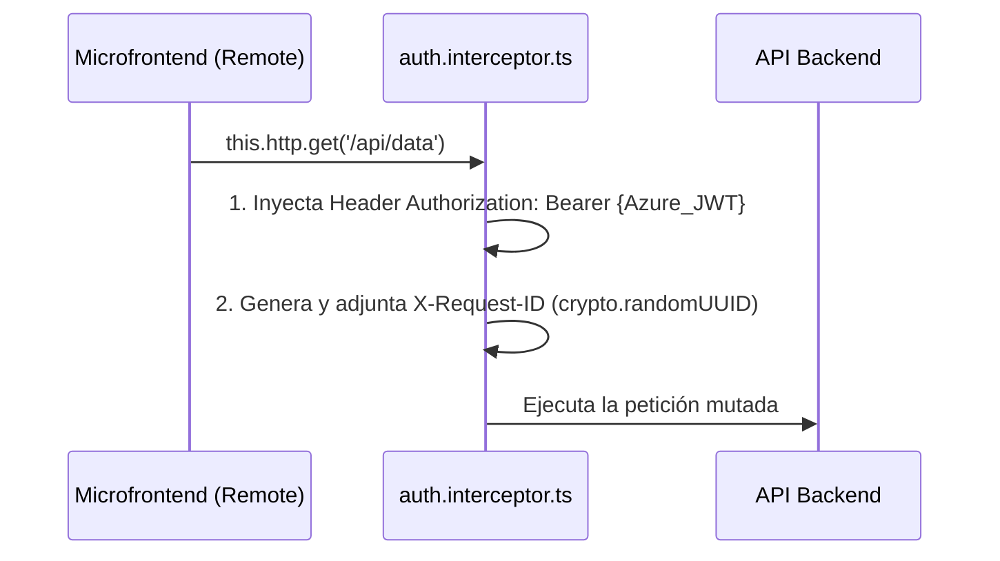

# Guía de Ejecución: Ecosistema Microfrontends

Este proyecto está configurado como un **Monorepo (Workspace) de Angular**. Esto significa que desde esta carpeta raíz se administran múltiples aplicaciones.

Actualmente, el ecosistema cuenta con dos aplicaciones:
1. **host** (Puerto 4200) - La aplicación base o contenedor principal.
2. **remote** (Puerto 4201) - El microfrontend que expone componentes/funcionalidades.

Ambos proyectos utilizan **Angular Native Federation** y **Tailwind CSS v4**.

---

## 🚀 Cómo ejecutar el proyecto en modo desarrollo

Para ver el ecosistema funcionando correctamente, necesitas tener ambos servidores ejecutándose simultáneamente. 

Ejecuta el siguiente comando maestro en la raíz de este proyecto (`/microfrontend`) para compilar y levantar simultáneamente el Host y todos los Microfrontends distribuidos:

```bash
npm run start:all
```

> 🌐 Podrás visualizar el ecosistema en tu navegador abriendo: **http://localhost:4200**
> 
> *Nota: Este script orquesta el levantamiento paralelo utilizando la librería `concurrently` y esquiva bloqueos por versiones de Node.js en Angular 22+.*

---

## 🏗️ Arquitectura: Del Alto al Bajo Nivel

El ecosistema sigue un patrón estricto basado en independizar dominios de negocio y reutilizar código UI mediante librerías internas, sin acoplar compilaciones ni despliegues.

### 1. Alto Nivel: Múltiples MFs y Módulos Federados
A nivel global, la arquitectura divide las responsabilidades de compilación y orquestación. **Module Federation solo se usa para cargar funcionalidades de negocio completas**, no para componentes visuales sueltos.



- **Independencia de despliegue:** `host` y `remote` tienen flujos de CI/CD completamente independientes. No existe acoplamiento de repositorios ni bloqueos en el lanzamiento de un release.
- **Exposición y Contrato Federado:** El Microfrontend expone su funcionalidad a través del archivo `remote/federation.config.js` mediante la propiedad `exposes` (ej. mapeando `./GithubProfiles` hacia su componente principal). El `host`, mediante su `app.routes.ts`, utiliza `loadRemoteModule` para descargar la aplicación de forma "Lazy Loaded" (bajo demanda) únicamente cuando el usuario accede a la ruta.
- **Restricción estricta:** No se deben crear dependencias directas de red entre MFs (ej. `host <--> remote` para un botón). Si un MFE necesita un componente UI, no debe pedirlo a otro MFE por red para evitar latencia, problemas de caché y puntos únicos de fallo.
- **Singletons:** Dependencias pesadas (`@angular/core`, `rxjs`, `tailwindcss`) están configuradas como `shared` en `federation.config.js` para cargarse una sola vez.

### 2. Nivel Medio: Librería Compartida (`core-ui`) en el Workspace
Para compartir la tabla y otros componentes complejos entre el `host` y los diferentes MFs, se utiliza una **librería interna estática** en el Monorepo. No se publica como librería NPM, ni como artefacto independiente, ni tiene pipeline propio.



- **Ubicación Física:** `projects/core-ui/`
- **Configuración TS (El Contrato de Consumo):** El archivo `tsconfig.json` raíz crea el alias `"core-ui"` apuntando directamente a `projects/core-ui/src/public-api.ts`.
- **Estrategia de compilación:** Cuando un MF (`remote` o `host`) requiere usar la tabla, importa este alias. Al construir el proyecto, el pipeline de compilación del MF en turno toma el código fuente de `core-ui` y **lo inyecta estáticamente en su propio bundle**.
```json
// tsconfig.json (Raíz)
{
  "compilerOptions": {
    "paths": {
      "core-ui": [
        "projects/core-ui/src/public-api.ts"
      ]
    }
  }
}
```

### 3. Bajo Nivel: Organización del Código y Contratos Agnosticos

A nivel de código, implementamos una separación estricta: **la UI jamás debe conocer la lógica de negocio ni el dominio de datos.**

#### 3.1. Librería `core-ui` (Dumb Components)
Ubicada en `projects/core-ui/src/lib/data-table/data-table.component.ts`. Es un componente standalone 100% agnóstico del dominio. Define contratos fuertes (interfaces) que dictan cómo los MFs deben interactuar con él:
```typescript
// Contrato base de la tabla (projects/core-ui/src/lib/...)
export interface CoreTableColumn {
  key: string;
  label: string;
}

@Component({
  selector: 'core-data-table',
  standalone: true,
  // ...
})
export class CoreDataTableComponent {
  // La tabla recibe la configuración, pero no sabe qué significa
  @Input() columns: CoreTableColumn[] = [];
  @Input() data: any[] = [];
  
  // Emite eventos hacia arriba para que el MF actúe
  @Output() search = new EventEmitter<string>();
}
```

#### 3.2. Consumo en los MFs (Smart Components)
El microfrontend (ej. `remote/src/app/github-profiles/`) conserva sus propios modelos (`GithubUser`), sus propios servicios inyectados (`GithubApiService`) y sus propias reglas de dominio y permisos. Su única relación con la tabla es inyectarle los datos formateados cumpliendo el contrato público.

Además, aplicamos una rígida **Separación de Responsabilidades (SoC)**. Ningún componente posee HTML en línea; todos están divididos en:
- `[nombre].component.ts`: Contiene la inyección de dependencias, mutación de Señales de Angular y la gestión de flujos asíncronos.
- `[nombre].component.html`: Contiene únicamente la vista, utilizando el *Control Flow* nativo (`@if`, `@for`) sin ensuciarse con lógica de negocio.



```html
<!-- remote/src/app/github-profiles/github-profiles.component.html -->
<core-data-table
  title="Usuarios de GitHub"
  [columns]="githubColumns"
  [data]="users"
  (search)="onSearch($event)">
</core-data-table>
```
*En el ejemplo superior, `CoreDataTableComponent` procesa el evento y renderiza las celdas, pero es ignorante de que está operando sobre "Usuarios de GitHub" o que consumió una API externa.*

#### 3.3. Testing Unitario Aislado (Jest Zoneless)
- **Configuración Moderna:** Configuramos el ecosistema para correr en modo *Zoneless* (`jest-preset-angular/setup-env/zoneless`), aprovechando la arquitectura ultramoderna de Angular 18+ para hacer el testing extremadamente rápido (pasando múltiples suites completas en escasos milisegundos) y sin dependencias mágicas en el DOM.
- **Aislamiento de Componentes Core:** La librería `core-ui` posee pruebas unitarias que validan las interacciones del DOM y la correcta emisión de los `@Input`/`@Output`, asegurando que su uso sea seguro para todos los MFs.
- **Simulación de Interacciones de UI (Smart Components):** En microfrontends complejos (`mf-complex`), testeamos programáticamente eventos reales del usuario, validando por ejemplo que un evento `KeyboardEvent` de tipo numérico dispare funciones preventivas (`preventDefault()`), asegurando un UX robusto y a prueba de errores.
- **Pruebas de Red y Seguridad (Interceptores):** Aseguramos la fiabilidad de nuestra "aduana" HTTP (`auth.interceptor.ts`) utilizando `HttpTestingController` de Angular. Simulamos peticiones ficticias e interceptamos su salida para asertar matemáticamente mediante tests que las cabeceras `Authorization` y `X-Request-ID` han sido mutadas e insertadas correctamente en cada request. Para evitar colisiones en CI/CD, mockeamos APIs criptográficas nativas del entorno NodeJS como `crypto.randomUUID`.
- **Mocks de Librerías Externas (MSAL):** Para componentes integrados a proveedores corporativos (como `login.component.ts`), simulamos por completo el SDK oficial (`MsalService`) usando `jest.spyOn()` e inyección de valores ficticios mediante dependencias (Ej: devolviendo `of({ idToken: 'fake' })`). Esto nos permite validar que nuestro código procese correctamente el inicio de sesión y navegue al Dashboard sin llegar a realizar peticiones verdaderas a los servidores de Microsoft durante los tests automáticos.

---

## 🛠️ Notas importantes para el desarrollo

- **Tailwind CSS:** Para usar clases de Tailwind, simplemente añádelas en el HTML de los componentes de cualquiera de los dos proyectos. La compilación se hará automáticamente.
- **Federation Config:** 
  - Si deseas exponer un componente desde el `remote` hacia el exterior, debes declararlo en el archivo `remote/federation.config.js` dentro del bloque `exposes`.
  - El `host` detectará automáticamente el código expuesto si configuras las rutas correctamente.
- **Pruebas Unitarias:** Ejecuta `npm run test` para correr las pruebas locales de todo el ecosistema y librerías compartidas.

---

## 🔐 Seguridad y Autenticación: Microsoft Entra ID (Azure AD)

*(Nota para Agentes IA / LLMs: Esta sección describe exhaustivamente la implementación técnica y dependencias para garantizar una correcta interpretación de contexto en futuras refactorizaciones de seguridad).*

El ecosistema delega la gestión de identidad corporativa a Microsoft Entra ID (anteriormente Azure Active Directory). La integración se basa en la librería oficial **Microsoft Authentication Library (MSAL)** en su última iteración para entornos Standalone de Angular.

### 1. Stack Tecnológico de Seguridad
- **Librerías Core:** `@azure/msal-angular` (v3.x) y `@azure/msal-browser` (v3.x).
- **Flujo Implementado:** OAuth 2.0 Authorization Code Flow con PKCE (Proof Key for Code Exchange). Se abandona el obsoleto *Implicit Flow* mitigando riesgos de intercepción de tokens en SPAs.
- **Manejo de Sesión:** Configurado estrictamente en `BrowserCacheLocation.SessionStorage` para forzar la destrucción física de los tokens (incluyendo JWT y Cache) en la memoria local al momento de cerrar la pestaña del navegador, previniendo secuestro de sesión en equipos compartidos.

### 2. Implementación Paso a Paso (Core Files)

Para que otra IA o desarrollador pueda rastrear la implementación, este es el rastro arquitectónico:

#### A. Inicialización en el Contenedor Principal (`host/src/app/app.config.ts`)
Angular (v15+) en modo Standalone requiere que el SDK de MSAL sea provisto como un Singleton durante el arranque. Se creó una fábrica (`MSALInstanceFactory`) que devuelve una instancia de `PublicClientApplication`.

```typescript
// Proveedor en app.config.ts
export function MSALInstanceFactory(): PublicClientApplication {
  return new PublicClientApplication({
    auth: {
      clientId: 'TU_CLIENT_ID_AQUI', // Reemplazar con ID de App Registration en Azure
      authority: 'https://login.microsoftonline.com/common', // O Tenant-ID específico
      redirectUri: 'http://localhost:4200'
    },
    cache: { cacheLocation: BrowserCacheLocation.SessionStorage }
  });
}
```
Esta fábrica se inyecta en el bloque `providers` junto con el token `MSAL_INSTANCE` y el servicio inyectable `MsalService`.

#### B. Flujo de Interacción UI (`host/src/app/login/login.component.ts`)
La llamada a la autenticación se dispara aislando la vista principal. Al presionar el botón de "Directorio Activo de Azure", se invoca `this.msalService.loginPopup()`.
- **Prevención XSS:** Al usar un Popup externo, se mitigan ataques XSS, pues el DOM del Host no tiene acceso a las credenciales digitadas.
- **Suscripción Reactiva:** El componente se suscribe al Observable de MSAL. En caso de éxito (`next`), se guarda el `response.idToken` en el Storage y el `Router` enruta al `/dashboard`. (Nota: Actualmente, se provee un Fallback de demostración en el `error` dado que se requiere un `clientId` real para completar el flujo en Producción).

#### C. Trazabilidad e Inyección (Aduana HTTP) (`host/src/app/core/interceptors/auth.interceptor.ts`)
La aplicación anfitriona (*Host*) declara un interceptor funcional que afecta en cascada a todos los microfrontends bajo su contexto. Toda petición de red realizada por cualquier MF pasará por aquí.



- **Inyección de JWT:** Recupera el token asíncrono y lo añade a `req.headers.set('Authorization', 'Bearer ...')`.
- **Inyección de Trazabilidad:** Para facilitar la observabilidad en logs de Backend (Datadog, Grafana), el interceptor llama a la API nativa `crypto.randomUUID()` inyectando a cada petición HTTP la cabecera `X-Request-ID`. Así, se rastrea cada clic del usuario transversal a los microservicios.

*(Si se requiere Bypass para otros proveedores, los desarrolladores deberán usar `HttpContext` de Angular en la petición de origen para evadir este interceptor).*
