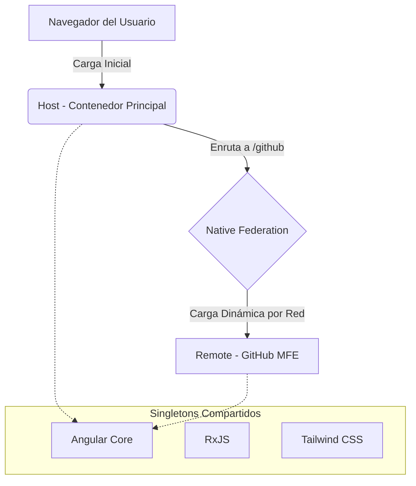
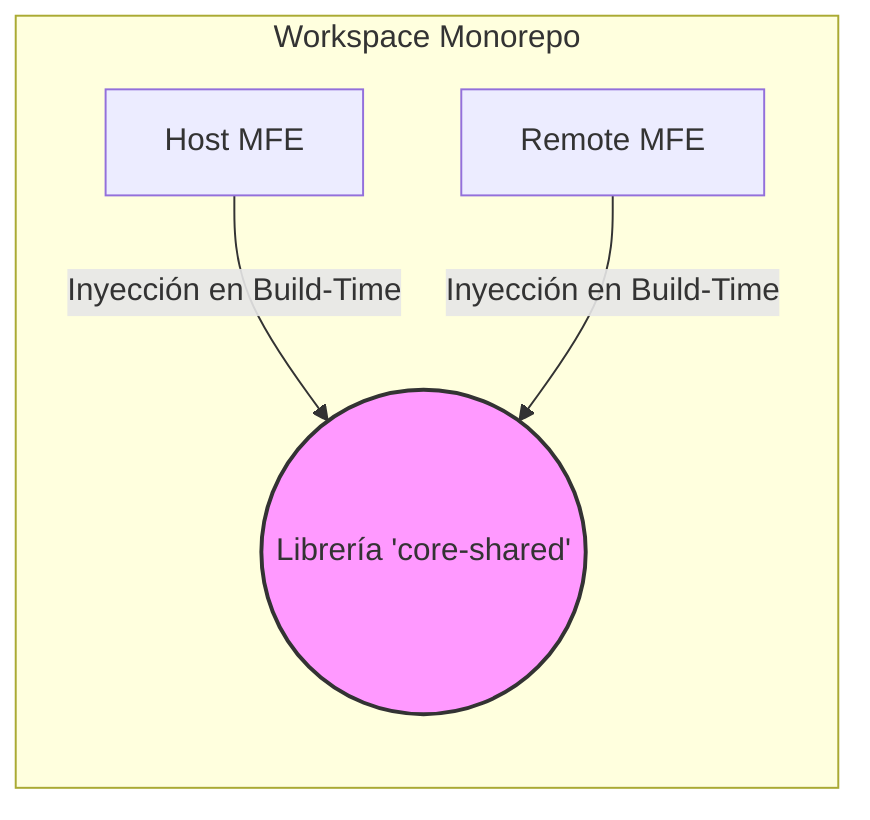
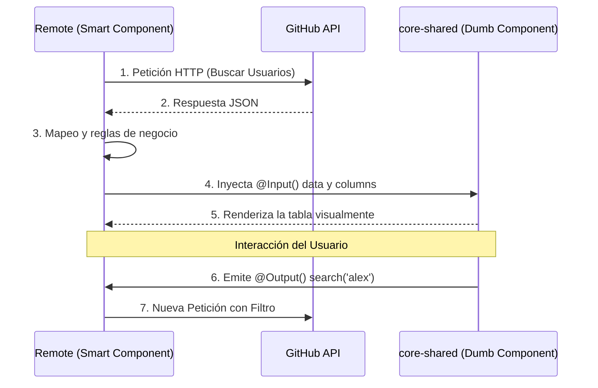
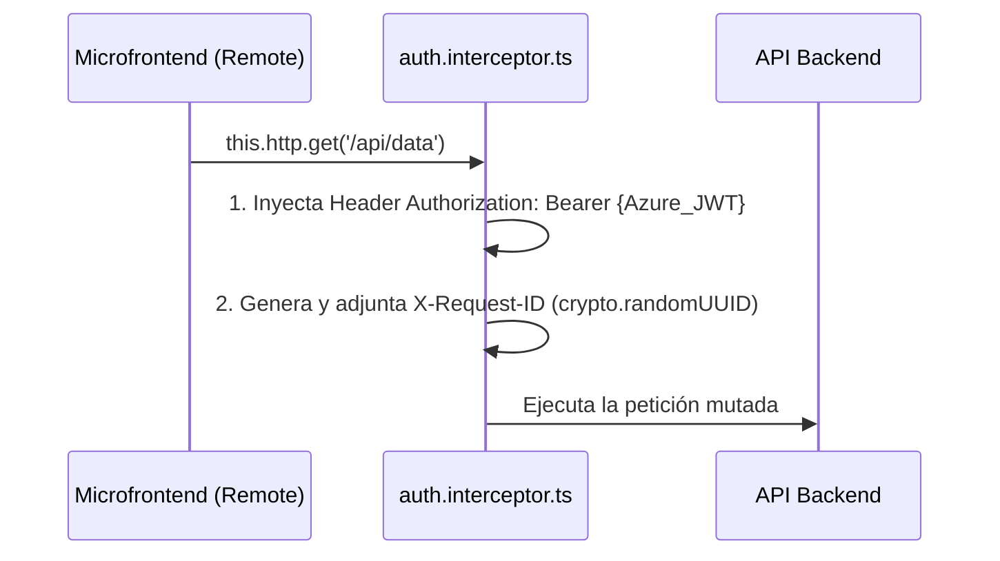
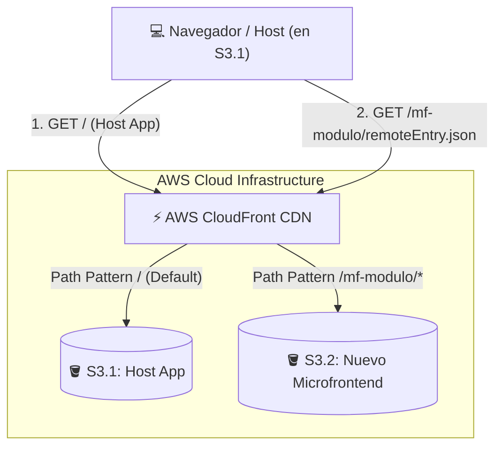
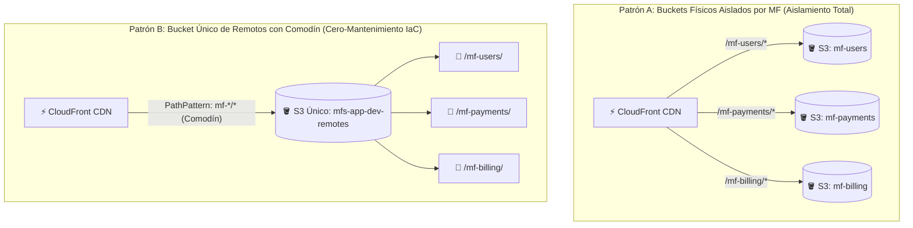

# Guía de Ejecución: Ecosistema Microfrontends

Este proyecto está configurado como un **Monorepo (Workspace) de Angular**. Esto significa que desde esta carpeta raíz se administran múltiples aplicaciones.

Actualmente, el ecosistema cuenta con un contenedor principal y múltiples microfrontends:
1. **host** (Puerto 4200) - La aplicación base o contenedor principal.
2. **mf-github-profiles** (Puerto 4201) - Microfrontend para perfiles de GitHub.
3. **mf-users** (Puerto 4202) - Microfrontend para la gestión de usuarios.
4. **mf-repos** (Puerto 4203) - Microfrontend para repositorios.
5. **mf-complex** (Puerto 4204) - Microfrontend para escenarios complejos y pruebas avanzadas.

Ambos proyectos utilizan **Angular Native Federation** y **Tailwind CSS v4**.

---

## 🚀 Cómo ejecutar el proyecto en modo desarrollo

Para ver el ecosistema funcionando correctamente, necesitas tener ambos servidores ejecutándose simultáneamente. 

Ejecuta el siguiente comando maestro en la raíz de este proyecto (`/microfrontend`) para compilar y levantar simultáneamente el Host y todos los Microfrontends distribuidos:

```bash
npm run start:all
```

> 🌐 Podrás visualizar el ecosistema en tu navegador abriendo: **http://localhost:4200**
> 
> *Nota: Este script orquesta el levantamiento paralelo utilizando la librería `concurrently` y esquiva bloqueos por versiones de Node.js en Angular 22+.*

---

## 🏗️ Arquitectura: Del Alto al Bajo Nivel

El ecosistema sigue un patrón estricto basado en independizar dominios de negocio y reutilizar código UI mediante librerías internas, sin acoplar compilaciones ni despliegues.

### 1. Alto Nivel: Múltiples MFs y Módulos Federados
A nivel global, la arquitectura divide las responsabilidades de compilación y orquestación. **Module Federation solo se usa para cargar funcionalidades de negocio completas**, no para componentes visuales sueltos.


```mermaid
graph TD
    A[Navegador del Usuario] -->|Carga Inicial| B(Host - Contenedor Principal)
    B -->|Enruta a /github| C{Native Federation}
    C -->|Carga Dinámica por Red| D[Remote - GitHub MFE]
    
    subgraph Singletons Compartidos
    E[Angular Core]
    F[RxJS]
    G[Tailwind CSS]
    end
    
    B -.-> E
    D -.-> E
```

- **Independencia de despliegue:** `host` y `remote` tienen flujos de CI/CD completamente independientes. No existe acoplamiento de repositorios ni bloqueos en el lanzamiento de un release.
- **Exposición y Contrato Federado:** El Microfrontend expone su funcionalidad a través del archivo `remote/federation.config.js` mediante la propiedad `exposes` (ej. mapeando `./GithubProfiles` hacia su componente principal). El `host`, mediante su `app.routes.ts`, utiliza `loadRemoteModule` para descargar la aplicación de forma "Lazy Loaded" (bajo demanda) únicamente cuando el usuario accede a la ruta.
- **Restricción estricta:** No se deben crear dependencias directas de red entre MFs (ej. `host <--> remote` para un botón). Si un MFE necesita un componente UI, no debe pedirlo a otro MFE por red para evitar latencia, problemas de caché y puntos únicos de fallo.
- **Singletons:** Dependencias pesadas (`@angular/core`, `rxjs`, `tailwindcss`) están configuradas como `shared` en `federation.config.js` para cargarse una sola vez.

### 2. Nivel Medio: Librería Compartida Transversal (`core-shared`)
Para compartir la lógica transversal (como la Autenticación, Tablas visuales y componentes complejos) entre el `host` y los diferentes MFs, se utiliza una **librería interna estática (Shared Core Library)** en el Monorepo. No se publica como librería NPM, ni como artefacto independiente, ni tiene pipeline de despliegue propio.


```mermaid
graph LR
    subgraph Workspace Monorepo
        A[Host MFE]
        B[Remote MFE]
        C((Librería 'core-shared'))
    end
    
    A -->|Inyección en Build-Time| C
    B -->|Inyección en Build-Time| C
    
    style C fill:#f9f,stroke:#333,stroke-width:2px
```

- **Ubicación Física:** `./core-shared/` (Contiene subdominios como `/ui` y `/auth`)
- **Configuración TS (El Contrato de Consumo):** El archivo `tsconfig.json` raíz crea el alias `"core-shared"` apuntando directamente a `./core-shared/src/public-api.ts`.
- **Estrategia de compilación (Tree Shaking):** Cuando un MF requiere usar un componente visual o validar permisos de seguridad, importa este alias. Al construir el proyecto, el compilador (esbuild) aplica *Tree Shaking*: extrae únicamente la porción de código exacta que se usó y **la inyecta estáticamente en el bundle final del MF**.
```json
// tsconfig.json (Raíz)
{
  "compilerOptions": {
    "paths": {
      "core-shared": [
        "./core-shared/src/public-api.ts"
      ]
    }
  }
}
```

#### 🔍 Aclaración sobre la Compilación y Despliegue de `core-shared` (Dynamic Shared Dependency)

**1. ¿Dónde está compilado `<core-data-table>` o el `AuthenticationService`?**

Están compilados como un "Chunk" de JavaScript independiente (ej. `chunk-core-shared.js`) generado dinámicamente gracias a la configuración del bloque `shared` en `federation.config.js`. Cuando el Host o un MF necesitan usar este código, no lo compilan de nuevo dentro de su código fuente, sino que lo cargan en memoria de forma unificada en tiempo de ejecución. 
En términos de infraestructura, cuando ejecutas `ng build host`, este chunk independiente se genera y se sube al Bucket de AWS S3 del Host.

**2. ¿Qué pasa si cambio o mejoro algo en `core-shared`?**

Gracias a esta arquitectura de Microfrontends de Consumo Dinámico, solucionamos el cuello de botella del CI/CD. 
Si modificas el código de `core-shared` hoy (ej. agregar una función a la tabla o un nuevo rol de seguridad), **SOLO DEBES COMPILAR Y DESPLEGAR EL HOST**. Los 50 Microfrontends restantes (como `mf-users` o `mf-repos`) heredarán el cambio automáticamente al refrescar el navegador, ya que todos consumen la misma referencia de red sin necesidad de disparar sus pipelines individuales.

### 3. Bajo Nivel: Organización del Código y Contratos Agnosticos

A nivel de código, implementamos una separación estricta: **la UI y los Servicios Transversales jamás deben conocer la lógica de negocio de los MFs.**

#### 3.1. Librería `core-shared/ui` (Dumb Components)
Ubicada en `core-shared/src/lib/ui/data-table/data-table.component.ts`. Es un componente standalone 100% agnóstico del dominio. Define contratos fuertes:
```typescript
// Contrato base de la tabla (core-shared/src/lib/ui/...)
export interface CoreTableColumn {
  key: string;
  label: string;
}

@Component({
  selector: 'core-data-table',
  standalone: true,
  // ...
})
export class CoreDataTableComponent {
  // La tabla recibe la configuración, pero no sabe qué significa
  @Input() columns: CoreTableColumn[] = [];
  @Input() data: any[] = [];
  
  // Emite eventos hacia arriba para que el MF actúe
  @Output() search = new EventEmitter<string>();
}
```

#### 3.2. Consumo en los MFs (Smart Components)
El microfrontend (ej. `remote/src/app/github-profiles/`) conserva sus propios modelos (`GithubUser`), sus propios servicios inyectados (`GithubApiService`) y sus propias reglas de dominio y permisos. Su única relación con la tabla es inyectarle los datos formateados cumpliendo el contrato público.

Además, aplicamos una rígida **Separación de Responsabilidades (SoC)**. Ningún componente posee HTML en línea; todos están divididos en:
- `[nombre].component.ts`: Contiene la inyección de dependencias, mutación de Señales de Angular y la gestión de flujos asíncronos.
- `[nombre].component.html`: Contiene únicamente la vista, utilizando el *Control Flow* nativo (`@if`, `@for`) sin ensuciarse con lógica de negocio.


```mermaid
sequenceDiagram
    participant MFE as Remote (Smart Component)
    participant API as GitHub API
    participant Table as core-shared (Dumb Component)
    
    MFE->>API: 1. Petición HTTP (Buscar Usuarios)
    API-->>MFE: 2. Respuesta JSON
    MFE->>MFE: 3. Mapeo y reglas de negocio
    MFE->>Table: 4. Inyecta @Input() data y columns
    Table-->>MFE: 5. Renderiza la tabla visualmente
    
    Note over Table,MFE: Interacción del Usuario
    Table->>MFE: 6. Emite @Output() search('alex')
    MFE->>API: 7. Nueva Petición con Filtro
```

```html
<!-- remote/src/app/github-profiles/github-profiles.component.html -->
<core-data-table
  title="Usuarios de GitHub"
  [columns]="githubColumns"
  [data]="users"
  (search)="onSearch($event)">
</core-data-table>
```
*En el ejemplo superior, `CoreDataTableComponent` procesa el evento y renderiza las celdas, pero es ignorante de que está operando sobre "Usuarios de GitHub" o que consumió una API externa.*

#### 3.3. Testing Unitario Aislado (Jest Zoneless)
- **Configuración Moderna:** Configuramos el ecosistema para correr en modo *Zoneless* (`jest-preset-angular/setup-env/zoneless`), aprovechando la arquitectura ultramoderna de Angular 18+ para hacer el testing extremadamente rápido (pasando múltiples suites completas en escasos milisegundos) y sin dependencias mágicas en el DOM.
- **Aislamiento de Componentes Core:** La librería `core-shared` posee pruebas unitarias que validan las interacciones del DOM y la correcta emisión de los `@Input`/`@Output`, asegurando que su uso sea seguro para todos los MFs.
- **Simulación de Interacciones de UI (Smart Components):** En microfrontends complejos (`mf-complex`), testeamos programáticamente eventos reales del usuario, validando por ejemplo que un evento `KeyboardEvent` de tipo numérico dispare funciones preventivas (`preventDefault()`), asegurando un UX robusto y a prueba de errores.
- **Pruebas de Red y Seguridad (Interceptores):** Aseguramos la fiabilidad de nuestra "aduana" HTTP (`auth.interceptor.ts`) utilizando `HttpTestingController` de Angular. Simulamos peticiones ficticias e interceptamos su salida para asertar matemáticamente mediante tests que las cabeceras `Authorization` y `X-Request-ID` han sido mutadas e insertadas correctamente en cada request. Para evitar colisiones en CI/CD, mockeamos APIs criptográficas nativas del entorno NodeJS como `crypto.randomUUID`.
- **Mocks de Librerías Externas (MSAL):** Para componentes integrados a proveedores corporativos (como `login.component.ts`), simulamos por completo el SDK oficial (`MsalService`) usando `jest.spyOn()` e inyección de valores ficticios mediante dependencias (Ej: devolviendo `of({ idToken: 'fake' })`). Esto nos permite validar que nuestro código procese correctamente el inicio de sesión y navegue al Dashboard sin llegar a realizar peticiones verdaderas a los servidores de Microsoft durante los tests automáticos.

---


---

## 📝 Guía Práctica: Cómo agregar un nuevo Microfrontend

Si necesitas escalar el ecosistema y agregar un nuevo dominio (por ejemplo, `mf-payments`), debes respetar las 3 capas arquitectónicas. Aquí tienes el paso a paso:

### Paso 1 (Alto Nivel): Creación y Federación
1. **Generar la aplicación:** Usa el CLI de Angular para generar el nuevo proyecto dentro del monorepo y agrégale Native Federation:
   ```bash
   ng g application mf-payments --port 4205
   ng add @angular-architects/native-federation --project mf-payments --port 4205
   ```
2. **Exponer el componente:** En `mf-payments/federation.config.js`, expón tu componente principal (Smart Component):
   ```javascript
   exposes: {
     './PaymentsRouter': { file: './mf-payments/src/app/payments/payments.component.ts' },
   },
   ```
3. **Registrarlo en el Host:**
   - Agrégalo al manifiesto del host (`host/public/federation.manifest.json`).
   - Crea la ruta perezosa en `host/src/app/app.routes.ts` usando `loadRemoteModule('mf-payments', './PaymentsRouter')`.

### Paso 2 (Nivel Medio): Integrar la Librería Transversal (`core-shared`)
No reinventes la rueda. El nuevo microfrontend **no debe** tener su propia configuración de MSAL, ni debe crear sus propios botones genéricos o tablas. Debe consumirlos estáticamente de la librería compartida.

En tu `payments.component.ts`:
```typescript
import { Component, inject, OnInit } from '@angular/core';
// 1. Importa TODO desde el alias global
import { CoreDataTableComponent, AuthenticationService } from 'core-shared'; 

@Component({
  selector: 'app-payments',
  standalone: true,
  imports: [CoreDataTableComponent], // Inyecta la UI
  templateUrl: './payments.component.html'
})
export class PaymentsComponent implements OnInit {
  private authService = inject(AuthenticationService); // Inyecta la seguridad
  canRefund = false;

  ngOnInit() {
    // 2. Utiliza la sesión compartida del navegador mágicamente
    this.canRefund = this.authService.hasPermission(['mf-refund-payments']);
  }
}
```

### Paso 3 (Bajo Nivel): Lógica de Negocio Aislada
En el HTML de `mf-payments`, inyecta tus datos específicos de pagos dentro de los *Dumb Components* compartidos:
```html
@if (canRefund) {
  <button class="bg-red-500 text-white">Procesar Reembolso</button>
}

<core-data-table
  title="Historial de Pagos"
  [columns]="paymentColumns"
  [data]="paymentsData"
  (search)="fetchPaymentsFromApi($event)">
</core-data-table>
```
*Recuerda:* `core-data-table` no sabe qué es un pago. Tu MF `mf-payments` es el único responsable de llamar a la API de pasarelas de pago y pasarle la data cruda a la tabla.

### Paso 4: Orquestación Final
Finalmente, abre el `package.json` de la raíz del monorepo y agrega tu nuevo MF al script `start:all` para que arranque concurrentemente junto con el resto del ecosistema:
```json
"start:all": "concurrently ... \"NG_DISABLE_VERSION_CHECK=1 ng serve mf-payments\""
```


## 🛠️ Notas importantes para el desarrollo

- **Tailwind CSS:** Para usar clases de Tailwind, simplemente añádelas en el HTML de los componentes de cualquiera de los proyectos. La compilación se hará automáticamente.
- **Federation Config:** 
  - Si deseas exponer un componente desde un microfrontend hacia el exterior, debes declararlo en su archivo `federation.config.js` (ej. `mf-users/federation.config.js`) dentro del bloque `exposes`.
  - El `host` detectará automáticamente el código expuesto si configuras las rutas correctamente en `app.routes.ts`.
- **Pruebas Unitarias:** Ejecuta `npm run test` para correr las pruebas locales de todo el ecosistema y librerías compartidas.
- **Estándares de Código:** El proyecto utiliza Prettier (`.prettierrc`) y EditorConfig. Asegúrate de tener configurado tu editor para auto-formatear el código.

---

## 🔐 Seguridad y Autenticación: Microsoft Entra ID (Azure AD)

*(Nota para Agentes IA / LLMs: Esta sección describe exhaustivamente la implementación técnica y dependencias para garantizar una correcta interpretación de contexto en futuras refactorizaciones de seguridad).*

El ecosistema delega la gestión de identidad corporativa a Microsoft Entra ID (anteriormente Azure Active Directory). La integración se basa en la librería oficial **Microsoft Authentication Library (MSAL)** en su última iteración para entornos Standalone de Angular.

### 1. Stack Tecnológico de Seguridad
- **Librerías Core:** `@azure/msal-angular` (v3.x) y `@azure/msal-browser` (v3.x).
- **Flujo Implementado:** OAuth 2.0 Authorization Code Flow con PKCE (Proof Key for Code Exchange). Se abandona el obsoleto *Implicit Flow* mitigando riesgos de intercepción de tokens en SPAs.
- **Manejo de Sesión:** Configurado estrictamente en `BrowserCacheLocation.SessionStorage` para forzar la destrucción física de los tokens (incluyendo JWT y Cache) en la memoria local al momento de cerrar la pestaña del navegador, previniendo secuestro de sesión en equipos compartidos.


### 3. Lógica Híbrida del Authentication Service
Además de interpretar el JWT (Decodificación y Roles), el `AuthenticationService` (ubicado en `core-shared`) está diseñado para sincronizarse con un Backend propio. Expone métodos como `saveSessionToken()`, `validateSessionToken()`, y `closeSessionToken()` que se comunican con `http://localhost:3000/api` para mantener la integridad de la sesión en bases de datos internas, más allá de la autenticación de Azure.

### 2. Implementación Paso a Paso (Core Files)

Para que otra IA o desarrollador pueda rastrear la implementación, este es el rastro arquitectónico:

#### A. Inicialización en el Contenedor Principal (`host/src/app/app.config.ts`)
Angular (v15+) en modo Standalone requiere que el SDK de MSAL sea provisto como un Singleton durante el arranque. Se creó una fábrica (`MSALInstanceFactory`) que devuelve una instancia de `PublicClientApplication`.

**⚠️ Acción Requerida para Desarrolladores:** Para probar el inicio de sesión localmente, debes dirigirte al archivo `host/src/app/app.config.ts` y reemplazar `'TU_CLIENT_ID_AQUI'` con un *Client ID* válido de Microsoft Entra ID.

```typescript
// Proveedor en app.config.ts
export function MSALInstanceFactory(): PublicClientApplication {
  return new PublicClientApplication({
    auth: {
      clientId: 'TU_CLIENT_ID_AQUI', // ¡Reemplazar con ID de App Registration en Azure!
      authority: 'https://login.microsoftonline.com/common', // O Tenant-ID específico
      redirectUri: 'http://localhost:4200'
    },
    cache: { cacheLocation: BrowserCacheLocation.SessionStorage }
  });
}
```
Esta fábrica se inyecta en el bloque `providers` junto con el token `MSAL_INSTANCE` y el servicio inyectable `MsalService`.

#### B. Flujo de Interacción UI (`host/src/app/login/login.component.ts`)
La llamada a la autenticación se dispara aislando la vista principal. Al presionar el botón de "Directorio Activo de Azure", se invoca `this.msalService.loginRedirect()`.
- **Regla de Negocio (Session Timeout):** Se optó por usar `loginRedirect()` de forma obligatoria en lugar de `loginPopup()`. Dado que el ecosistema requiere forzar un cierre y validación severa de sesión a los 20 minutos de inactividad, el redireccionamiento asegura que la página web recargue por completo desde cero sus variables de memoria cada vez que expira, evitando fugas de estado en memoria en los Single Page Applications.
- **Captura Global de Token:** Tras redireccionar de vuelta desde los servidores de Microsoft, Angular reinicia su ciclo de vida y es el **`app.component.ts`** el encargado de suscribirse al `this.msalService.handleRedirectObservable()`, recuperar el JWT desde la barra de direcciones de forma segura y guardarlo en `SessionStorage` antes de enviarlo al Dashboard.
#### C. Trazabilidad e Inyección (Aduana HTTP) (`host/src/app/core/interceptors/auth.interceptor.ts`)
La aplicación anfitriona (*Host*) declara un interceptor funcional que afecta en cascada a todos los microfrontends bajo su contexto. Toda petición de red realizada por cualquier MF pasará por aquí.

**Whitelisting de Dominios (Seguridad):** El interceptor previene inyectar el token JWT de Microsoft en peticiones dirigidas a APIs de terceros utilizando el arreglo `externalDomains`. Por ejemplo, `api.github.com` y `s3.amazonaws.com` están excluidos para evitar errores de CORS y fugas de tokens corporativos. Si un nuevo MF necesita llamar a una API externa, ese dominio debe registrarse aquí.

```mermaid
sequenceDiagram
    participant MFE as Microfrontend (Remote)
    participant Interceptor as auth.interceptor.ts
    participant Backend as API Backend
    
    MFE->>Interceptor: this.http.get('/api/data')
    Interceptor->>Interceptor: 1. Inyecta Header Authorization: Bearer {Azure_JWT}
    Interceptor->>Interceptor: 2. Genera y adjunta X-Request-ID (crypto.randomUUID)
    Interceptor->>Backend: Ejecuta la petición mutada
```

- **Inyección de JWT:** Recupera el token asíncrono y lo añade a `req.headers.set('Authorization', 'Bearer ...')`.
- **Inyección de Trazabilidad:** Para facilitar la observabilidad en logs de Backend (Datadog, Grafana), el interceptor llama a la API nativa `crypto.randomUUID()` inyectando a cada petición HTTP la cabecera `X-Request-ID`. Así, se rastrea cada clic del usuario transversal a los microservicios.

*(Si se requiere Bypass para otros proveedores, los desarrolladores deberán usar `HttpContext` de Angular en la petición de origen para evadir este interceptor).*


## 🤖 Prompts de Refactorización para Agentes IA

Si necesitas utilizar un Agente de Inteligencia Artificial (Antigravity, Copilot, Cursor) para escalar este ecosistema, utiliza los siguientes prompts diseñados para máxima eficiencia. Proveen el contexto arquitectónico exacto para que la IA entienda el "por qué" y ejecute la tarea enfocada en la necesidad del despliegue, sin redundancias:

### 1. Crear una nueva librería transversal
> **Prompt:** "Actúa como un Arquitecto Angular experto en Native Federation. Crea una nueva librería transversal llamada `core-shared`. No debe ser una aplicación ejecutable. Genera la estructura de carpetas, configura `public-api.ts`, el alias en `tsconfig.json` raíz, y configúrala en el `federation.config.js` del Host como *Shared Dependency* (`singleton: true`, `strictVersion: false`). **Contexto de Negocio:** Esta configuración dinámica es un requisito estricto para asegurar que futuras actualizaciones en la librería solo requieran redesplegar el Host y el MF implicado, eliminando la necesidad de recompilar los 50+ microfrontends de la empresa. Valida compilación."

### 2. Centralizar Servicios de Autenticación (`AuthService`)
> **Prompt:** "Analiza los Microfrontends (`mf-*`) y el `host`. Centraliza toda la lógica de autenticación, validación de JWT y manejo de `sessionStorage` en `core-shared/auth`. Refactoriza cada MF para eliminar su lógica local e inyectar el servicio central desde el alias `'core-shared'`. **Contexto de Negocio:** Los MFs deben consumir la versión singleton proveída dinámicamente por la Federación. El objetivo de la tarea es garantizar que un futuro parche de seguridad en `AuthService` se propague instantáneamente a todo el ecosistema con tan solo redesplegar el Host (que distribuye el chunk modificado). Repara las pruebas unitarias."

### 3. Extraer Componentes Comunes y Limpiar Deuda Técnica
> **Prompt:** "Analiza los MFs (ej. `mf-users`, `mf-repos`). Identifica Dumb Components genéricos duplicados (botones, modales, tablas). Mueve estos componentes a `core-shared/src/lib/ui/`, expórtalos en `public-api.ts` y refactoriza los MFs para consumirlos desde `'core-shared'`. Elimina el código duplicado y las dependencias sin uso. **Contexto de Negocio:** Todo componente extraído debe distribuirse dinámicamente. Esto garantiza que un rediseño UI futuro (ej. cambiar un color primario) solo requiera redesplegar el Host y el MF directamente afectado, facilitando el control de versiones independientes en AWS S3. Repara `jest`, valida `esbuild` y asegura ausencia de dependencias cíclicas."

---

## 📐 Caso de Estudio Arquitectónico: Desacoplamiento de Buckets S3 y Acceso a Microfrontends

### Problema: Migración de S3 Monolítico a S3 Independientes por Microfrontend
Al separar los microfrontends de un solo bucket S3 monolítico (donde todo vivía bajo subcarpetas `/mf-*`) a **buckets S3 desacoplados e independientes por MF (ej. `S3.1` para Host y `S3.2` para `mf-*`)**, se pueden presentar dos problemas si no se configura la infraestructura adecuadamente:
1. **Error HTTP 403 (Forbidden / Access Denied):** Al intentar consumir directamente las URLs de S3.2 (`https://s3.2.amazonaws.com/...`), S3 rechaza las peticiones por tener bloqueado el acceso público (`Block Public Access = true`).
2. **URLs Temporales / Expirables o Bloqueos CORS:** Al no usar una CDN unificada, el llamado directo entre dominios o mediante URLs presignadas rompe la carga estática de `remoteEntry.json`.


```mermaid
flowchart TD
    Browser["💻 Navegador / Host (en S3.1)"] -->|"1. GET / (Host App)"| CF["⚡ AWS CloudFront CDN"]
    Browser -->|"2. GET /mf-modulo/remoteEntry.json"| CF
    
    subgraph "AWS Cloud Infrastructure"
        direction TB
        CF -->|"Path Pattern / (Default)"| S3_1[("🪣 S3.1: Host App")]
        CF -->|"Path Pattern /mf-modulo/*"| S3_2[("🪣 S3.2: Nuevo Microfrontend")]
    end
```

### Solución Arquitectónica Recomendada (3 Pasos)

1. **Fachada Unificada en CloudFront (Origen y Cache Behavior):**
   - En la distribución de CloudFront, se añade `S3.2` como un **Origin** independiente.
   - Se crea un **Cache Behavior** para la ruta `mf-modulo/*` dirigida al origen `S3.2`.
   - *Resultado:* El navegador solicita `https://mi-dominio.com/mf-modulo/remoteEntry.json`. Para la aplicación y el navegador, la petición es hacia el **mismo origen**, eliminando errores 403 y previniendo bloqueos de CORS.

2. **Permisos de Lectura mediante OAC (Origin Access Control):**
   - El bucket `S3.2` se mantiene 100% privado sin acceso público directo.
   - En la **S3 Bucket Policy** de `S3.2`, se concede acceso `s3:GetObject` exclusivamente al Service Principal de CloudFront filtrado por la condición `AWS:SourceArn`.

3. **Configuración CORS en S3 (En caso de dominios CDN independientes):**
   - Si por razones de negocio `S3.2` se sirve a través de otro dominio o CDN separado, se deben configurar las reglas CORS (`AllowedOrigins`, `AllowedHeaders`, `AllowedMethods`) en `S3.2` permitiendo el dominio del Host.

---

## 🚀 Estrategias de Escalabilidad de Infraestructura (IaC) para N Microfrontends

*(Nota: Esta estrategia de comodines y patrones de almacenamiento aplica exclusivamente a la capa de Infraestructura e IaC en CloudFront y S3. En la capa de aplicación Angular / Native Federation, cada microfrontend sigue exponiendo sus componentes e integrando sus rutas independientemente).*

Cuando el ecosistema crece de 5 a **decenas de Microfrontends** (`mf-payments`, `mf-billing`, `mf-reports`), existen dos patrones de arquitectura para escalar el aprovisionamiento de infraestructura:


```mermaid
flowchart TD
    subgraph "Patrón A: Buckets Físicos Aislados por MF (Aislamiento Total)"
        CF_A["⚡ CloudFront CDN"] -->|"/mf-users/*"| S3_Users[("🪣 S3: mf-users")]
        CF_A -->|"/mf-payments/*"| S3_Pay[("🪣 S3: mf-payments")]
        CF_A -->|"/mf-billing/*"| S3_Bill[("🪣 S3: mf-billing")]
    end

    subgraph "Patrón B: Bucket Único de Remotos con Comodín (Cero-Mantenimiento IaC)"
        CF_B["⚡ CloudFront CDN"] -->|"PathPattern: mf-*/* (Comodín)"| S3_Remotes[("🪣 S3 Único: mfs-app-dev-remotes")]
        S3_Remotes --> Folder1["📁 /mf-users/"]
        S3_Remotes --> Folder2["📁 /mf-payments/"]
        S3_Remotes --> Folder3["📁 /mf-billing/"]
    end
```

---

### 🟢 1. Alto Nivel (Decisión Estratégica)

* **Patrón A (Bucket Físico por MF - Aislamiento Total):** Cada microfrontend tiene su propio bucket S3 independiente. Recomendado para organizaciones donde cada equipo o squad administra su propia cuenta de AWS o bucket S3 con permisos IAM aislados.
* **Patrón B (Bucket Único de Remotos con Comodín `mf-*/*` - Cero Mantenimiento IaC):** Existe 1 bucket para el Host (`HostBucket`) y **1 solo bucket secundario para todos los remotos** (`RemotesBucket`). Cada nuevo MF se sube a su propia subcarpeta (`/mf-payments/`, `/mf-billing/`). CloudFront utiliza una regla con el comodín `mf-*/*`. **Ventaja:** Agregar un nuevo MF **no requiere tocar CloudFormation ni modificar la infraestructura**.

---

### 🟡 2. Medio Nivel (Arquitectura Técnica y Comodines en CloudFront)

#### Comparativa Técnica de Implementación:

| Criterio | Patrón A: Bucket Aislado por MF | Patrón B: Bucket Único Remoto (`mf-*/*`) |
| :--- | :--- | :--- |
| **Uso de Comodín `*`** | No es posible en la raíz de origen (CloudFront requiere 1 Origen por cada Bucket S3). | **SÍ** (`PathPattern: "mf-*/*"` abarca cualquier subcarpeta de remotos). |
| **Cambios en IaC (CloudFormation)** | Modificar `mfs-stack.yaml` por cada nuevo MF. | **Cero cambios en CloudFormation** al agregar nuevos MFs. |
| **Seguridad IAM** | Aislamiento físico 100% por Bucket. | Aislamiento lógico por prefijo de carpeta (`s3:::bucket/mf-payments/*`). |
| **Número de Buckets S3** | N Buckets creados. | 2 Buckets creados (`host` + `remotes`). |

---

### 🔴 3. Bajo Nivel (Configuración Exclusiva de Infraestructura e IaC)

#### A. Configuración YAML en CloudFormation para el Patrón B (Comodín `mf-*/*`):

```yaml
Resources:
  # 1. Bucket Único para Todos los Remotos
  RemotesBucket:
    Type: AWS::S3::Bucket
    Properties:
      BucketName: !Sub "${ProjectPrefix}-${Environment}-remotes"
      CorsConfiguration:
        CorsRules:
          - AllowedHeaders: ['*']
            AllowedMethods: ['GET', 'HEAD']
            AllowedOrigins: ['*']
            MaxAge: 3600

  # 2. Origen Único en CloudFront
  CloudFrontDistribution:
    Type: AWS::CloudFront::Distribution
    Properties:
      DistributionConfig:
        Origins:
          - Id: HostOrigin
            DomainName: !GetAtt HostBucket.RegionalDomainName
            OriginAccessControlId: !GetAtt CloudFrontOAC.Id
          - Id: RemotesOrigin
            DomainName: !GetAtt RemotesBucket.RegionalDomainName
            OriginAccessControlId: !GetAtt CloudFrontOAC.Id

        # 3. ÚNICA REGLA DE CACHÉ CON COMODÍN (Abarca infinitos MFs futuros)
        CacheBehaviors:
          - PathPattern: "mf-*/*"
            TargetOriginId: RemotesOrigin
            ViewerProtocolPolicy: redirect-to-https
            AllowedMethods: ['GET', 'HEAD', 'OPTIONS']
            CachedMethods: ['GET', 'HEAD']
            Compress: true
            ForwardedValues:
              QueryString: true
              Cookies:
                Forward: none

  # 4. Política de Acceso OAC para el Bucket de Remotos (Seguridad 100% Privada)
  RemotesBucketPolicy:
    Type: AWS::S3::BucketPolicy
    Properties:
      Bucket: !Ref RemotesBucket
      PolicyDocument:
        Statement:
          - Effect: Allow
            Principal:
              Service: cloudfront.amazonaws.com
            Action: 's3:GetObject'
            Resource: !Sub "${RemotesBucket.Arn}/*"
            Condition:
              StringEquals:
                AWS:SourceArn: !Sub "arn:aws:cloudfront::${AWS::AccountId}:distribution/${CloudFrontDistribution}"
```


