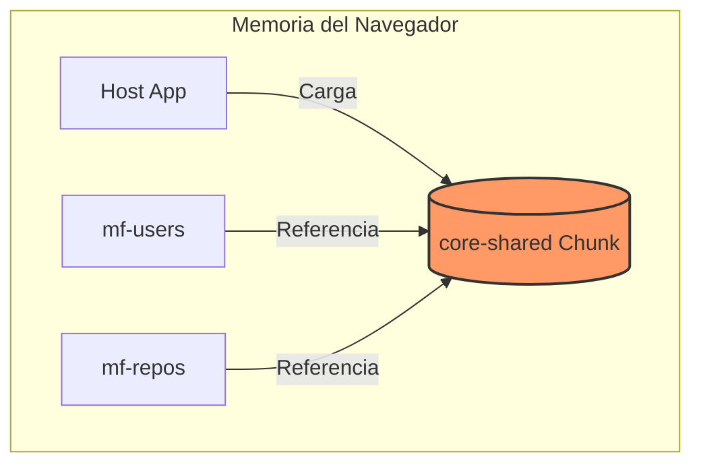
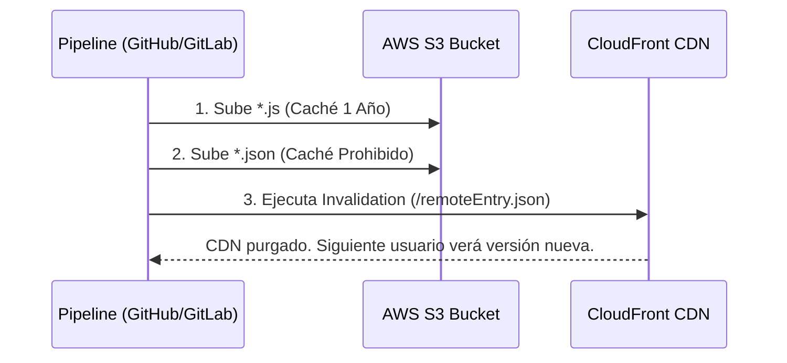
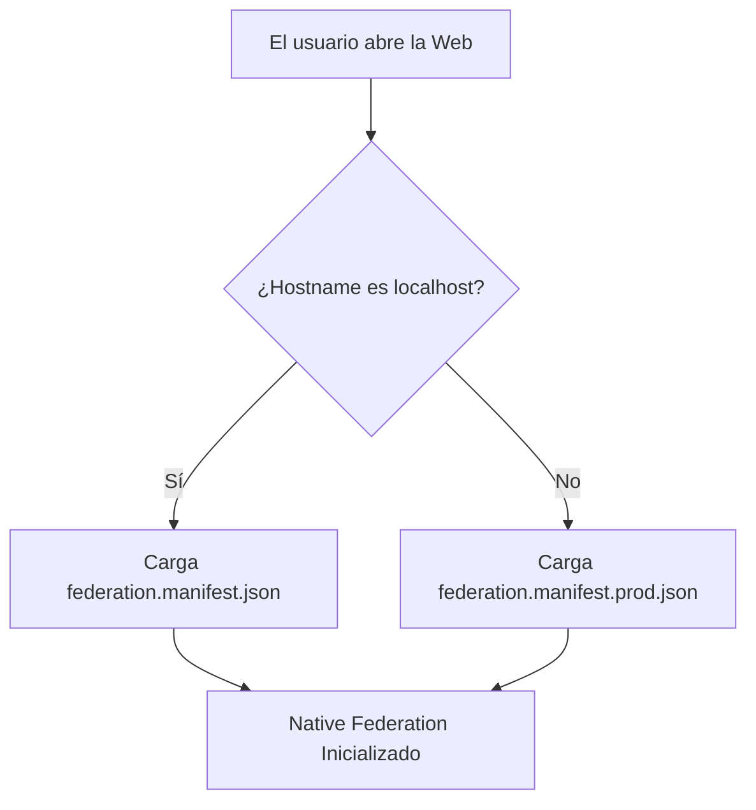

# 🛠️ Plan de Acción Detallado: Despliegue Masivo en AWS S3

Este plan proporciona las instrucciones técnicas, configuraciones de código y comandos exactos para resolver los 4 riesgos críticos de infraestructura del ecosistema de Microfrontends. Se desglosa cada solución en 3 niveles de entendimiento (Alto, Medio y Bajo) para facilitar su implementación.

---

## Solución 1: Escapar del Cuello de Botella del CI/CD (Librería Transversal)

*   **Alto Nivel (Concepto Estratégico):** Evitaremos que el código compartido se copie 50 veces. Convertiremos la librería `core-shared` en un "Servicio Desacoplado". Si queremos cambiar el color de un botón global, lo actualizamos una sola vez y todos los MFs heredarán el cambio automáticamente sin tener que recompilarlos.
*   **Medio Nivel (Arquitectura Angular):** Utilizaremos la propiedad `shared` de Native Federation. En lugar de inyectar el código estáticamente mediante el `tsconfig.json`, Angular empaquetará `core-shared` en un chunk independiente. El Host cargará este chunk en la memoria del navegador, y los MFs simplemente lo consumirán por referencia.



*   **Bajo Nivel (Archivos y Código Exacto):** 
    **Archivos Afectados:** `host/federation.config.js` y `mf-[nombre]/federation.config.js` (TODOS los proyectos).
    ```javascript
    // federation.config.js
    const { withNativeFederation, shareAll } = require('@angular-architects/native-federation/config');

    module.exports = withNativeFederation({
      shared: {
        ...shareAll({ singleton: true, strictVersion: true, requiredVersion: 'auto' }),
        // Declaramos explícitamente nuestra librería interna como compartida
        'core-shared': { singleton: true, strictVersion: false } 
      }
    });
    ```

---

## Solución 2: Estrategia Definitiva de Caché (AWS S3 + CloudFront)

*   **Alto Nivel (Concepto Estratégico):** Asegurar que cuando un usuario entra a tu página, NUNCA vea una versión vieja y rota de la aplicación. Le diremos a Internet (CloudFront) que recuerde por siempre las imágenes y el código pesado, pero que NUNCA recuerde el "Índice" de la página.
*   **Medio Nivel (Arquitectura Cloud):** Los archivos compilados de Angular tienen un *hash* (ej. `chunk-123.js`). Estos son inmutables y seguros para el caché. Sin embargo, el archivo `remoteEntry.json` mantiene siempre el mismo nombre. Dividiremos el comando de S3 en dos partes y forzaremos la invalidación.



*   **Bajo Nivel (Archivos y Código Exacto):** 
    **Archivos Afectados:** `.github/workflows/deploy.yml` o tu script de `.gitlab-ci.yml`.
    ```bash
    # 1. Subir archivos JS/CSS (Permitir Caché de 1 año)
    aws s3 sync dist/mf-users/browser s3://mi-bucket-mf-users       --exclude "*.json"       --cache-control "public, max-age=31536000, immutable"

    # 2. Subir el Índice Maestro (Prohibir Caché completamente)
    aws s3 sync dist/mf-users/browser s3://mi-bucket-mf-users       --exclude "*" --include "*.json"       --cache-control "no-cache, no-store, must-revalidate"

    # 3. Forzar a CloudFront a limpiar su memoria global
    aws cloudfront create-invalidation --distribution-id E1A2B3C4D5 --paths "/remoteEntry.json"
    ```

---

## Solución 3: Control de Versiones de Estado (`sessionStorage`)

*   **Alto Nivel (Concepto Estratégico):** Evitar que la aplicación se congele si un Microfrontend antiguo intenta leer la sesión de seguridad de una forma que el Host nuevo ya no usa. Trataremos a la memoria del navegador con el mismo cuidado que una base de datos.
*   **Medio Nivel (Arquitectura de Estado):** Adoptaremos un patrón de "Versionado de Contratos". Si la forma en la que guardamos el Token JWT cambia, no sobreescribiremos la llave anterior, sino que crearemos una nueva llave (V2).

```mermaid
flowchart LR
    Host[Host V2] --> |Escribe| V2[(sessionStorage: jwt_v2)]
    MF_Nuevo[MF Users V2] --> |Lee Correctamente| V2
    MF_Viejo[MF Repos V1] -.-> |Busca (No encuentra)| V1[(sessionStorage: jwt_v1)]
    MF_Viejo --> |Cae con Gracia| Fallback[Pide Login de nuevo]
```

*   **Bajo Nivel (Archivos y Código Exacto):** 
    **Archivos Afectados:** `core-shared/src/lib/auth/authentication.service.ts`.
    ```typescript
    // Definimos la llave como una constante versionada
    const SESSION_KEY = 'msal_jwt_token_v1'; 

    public getToken(): string | null {
       return sessionStorage.getItem(SESSION_KEY);
    }
    
    // Si en 2 años se cambia el contrato a un Objeto JSON:
    // const SESSION_KEY = 'msal_jwt_token_v2'; 
    ```

---

## Solución 4: Resolución Dinámica de URLs (Adiós Localhost)

*   **Alto Nivel (Concepto Estratégico):** Hacer que la aplicación sea inteligente para saber si el usuario la abrió localmente o en Producción, y cargar los Microfrontends correctos sin necesidad de tener múltiples compilaciones.
*   **Medio Nivel (Arquitectura Angular):** Modificaremos el Bootstrap. Usaremos JavaScript para leer la URL del navegador (`window.location.hostname`) y decidir en tiempo real si descargamos el manifiesto de Localhost o el manifiesto de CloudFront.



*   **Bajo Nivel (Archivos y Código Exacto):** 
    **Archivos Afectados:**
    1.  `host/public/federation.manifest.json` (rutas locales).
    2.  `host/public/federation.manifest.prod.json` (rutas de S3 - **NUEVO**).
    3.  `host/src/main.ts` (Modificación de Bootstrap).

    **En `host/src/main.ts`**:
    ```typescript
    import { initFederation } from '@angular-architects/native-federation';

    // Se detecta el entorno actual (Prod vs Local) dinámicamente
    const isProd = window.location.hostname !== 'localhost';
    
    const manifestPath = isProd 
        ? '/assets/federation.manifest.prod.json' 
        : '/assets/federation.manifest.json';

    // Inicializa la Federación apuntando al archivo correcto
    initFederation(manifestPath)
      .catch(err => console.error(err))
      .then(_ => import('./bootstrap'))
      .catch(err => console.error(err));
    ```
