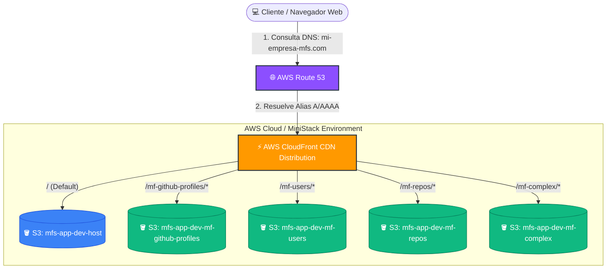
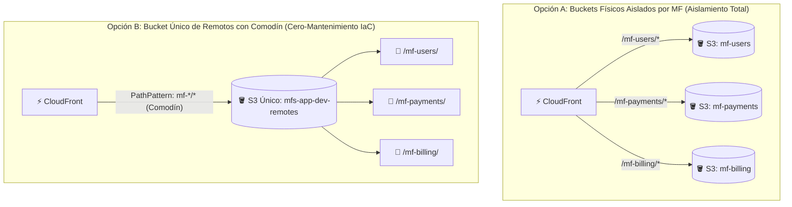
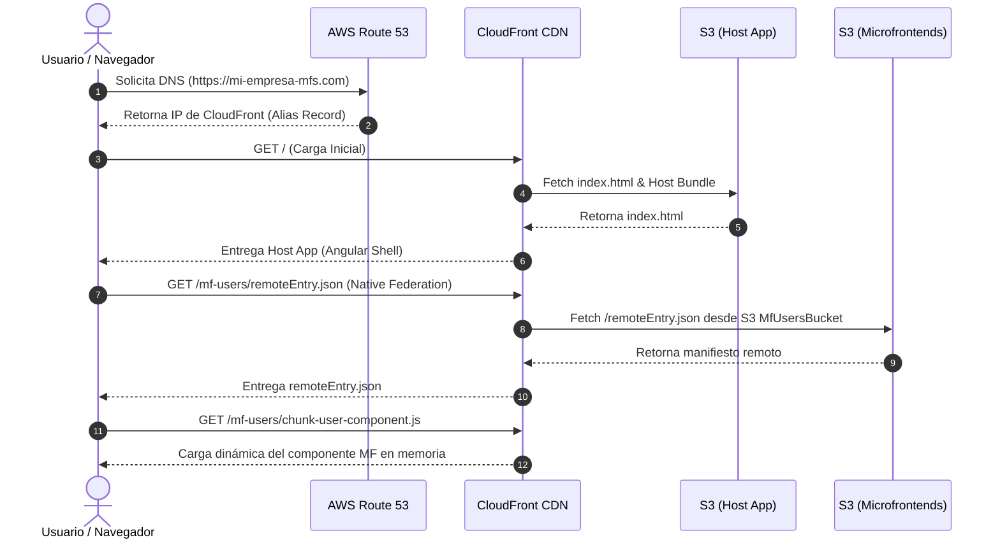
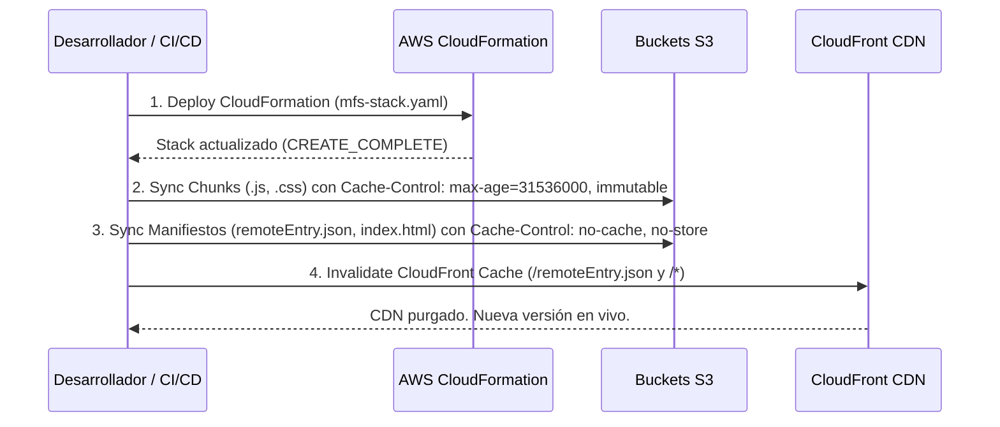

# 📘 Manual de Infraestructura e IaC (CloudFormation, Route53, CloudFront & MiniStack)

Este manual documenta la arquitectura de infraestructura como código (IaC), las plantillas de AWS CloudFormation y los scripts de automatización para el despliegue del ecosistema de Microfrontends (`host`, `mf-github-profiles`, `mf-users`, `mf-repos` y `mf-complex`).

---

## 🏔️ 1. Alto Nivel (Concepto Estratégico y Visión General)

### ¿Qué problema resuelve esta infraestructura?
En una arquitectura monolítica tradicional, un solo servidor sirve todo el código. En nuestro ecosistema de **Microfrontends (MFs)**, cada módulo es una aplicación independiente construida con Angular y Native Federation.

Para desplegar esta solución de forma escalable, segura y económica:
1. **Resolución DNS Personalizada (AWS Route 53):** Route 53 resuelve el nombre de dominio corporativo (ej. `https://mi-empresa-mfs.com`) mediante registros Alias A y AAAA sin latencia adicional.
2. **Punto Único de Entrada y Seguridad (AWS CloudFront CDN):** Una sola distribución de CloudFront actúa como fachada/proxy unificado con certificado SSL/TLS (HTTPS). Para el navegador, la app parece un único sitio web en un solo dominio, eliminando problemas de puertos múltiples o peticiones inter-origen complejas.
3. **Desacoplamiento Total en Almacenamiento (AWS S3):** Cada microfrontend vive en su propio almacenamiento independiente (Bucket S3). Esto permite a diferentes equipos desplegar `mf-users` o `mf-repos` sin tocar ni poner en riesgo el `host`.
4. **Entorno Simulado Local (MiniStack):** Permite a los desarrolladores probar el 100% de la infraestructura de AWS (CloudFormation, S3, CloudFront, Route53) en sus máquinas locales de manera totalmente gratuita.

---

### 🎨 Diagrama General de Arquitectura de Servicios



---

## 🏛️ 2. Medio Nivel (Arquitectura Técnica y Flujos de Datos)

### Componentes de CloudFormation (`mfs-stack.yaml`)

El stack de CloudFormation (`infrastructure/cloudformation/mfs-stack.yaml`) define declarativamente los recursos de AWS:

#### 1. AWS Route 53 (Registros DNS Alias)
- **`Route53RecordA` / `Route53RecordAAAA`:** Crea registros tipo `A` (IPv4) y `AAAA` (IPv6) que apuntan el dominio personalizado (`DomainName`) hacia la distribución de CloudFront (`CloudFrontDistribution.DomainName`).
- **Condición `HasCustomDomain`:** Los recursos de Route 53 solo se crean si los parámetros `DomainName` y `HostedZoneId` son proporcionados.

#### 2. Buckets S3 (5 Buckets de Origen)
- `HostBucket`: Almacena la aplicación shell contenedora (`dist/host/browser`).
- `MfGithubProfilesBucket`, `MfUsersBucket`, `MfReposBucket`, `MfComplexBucket`: Almacenan cada MF remoto.
- **Configuración CORS:** Reglas CORS explicitas (`AllowedOrigins: '*'`, `AllowedMethods: ['GET', 'HEAD']`) para permitir que Native Federation descargue los módulos JS inter-origen.

#### 3. Seguridad y Acceso (OAC / OAI)
- **Origin Access Control (OAC)** y **Origin Access Identity (OAI):** Bloquean el acceso público directo a los buckets S3. Solo CloudFront tiene permiso firmado (`s3:GetObject`) para leer los archivos.

#### 4. Distribución CloudFront
- **Comportamiento por Defecto (`/`):** Dirige al `HostBucket`.
- **Rutas Específicas (Cache Behaviors):**
  - `/mf-github-profiles/*` ➔ `MfGithubProfilesBucket`
  - `/mf-users/*` ➔ `MfUsersBucket`
  - `/mf-repos/*` ➔ `MfReposBucket`
  - `/mf-complex/*` ➔ `MfComplexBucket`
- **Manejo de Errores SPA:** Mapea los errores `403` y `404` a `/index.html` (HTTP 200) para el enrutamiento del lado del cliente de Angular.

---

## 🚀 2.1. Estrategias de Escalabilidad e IaC al Agregar N Microfrontends

Cuando la organización crece y se pasa de 5 a **decenas de Microfrontends** (`mf-payments`, `mf-billing`, `mf-reports`, etc.), existen dos estrategias de arquitectura para gestionar el almacenamiento y la CDN:



---

### 🟢 1. Alto Nivel (Decisión Estratégica)

* **Patrón A (Bucket Físico por MF - Actual):** Cada microfrontend tiene su propio bucket S3 independiente. Ideal para corporaciones con estrictas políticas de gobernanza donde cada equipo administra su propia cuenta o bucket sin compartir recursos con otros equipos.
* **Patrón B (Bucket Único de Remotos con Comodín `mf-*/*`):** Existe un bucket `HostBucket` y **un solo bucket secundario** `RemotesBucket`. Todos los microfrontends remotos se suben a subcarpetas (`/mf-payments/`, `/mf-billing/`). CloudFront utiliza una sola regla con comodín `mf-*/*`. Ideal para agilidad de CI/CD ya que **agregar un nuevo MF no requiere modificar CloudFormation ni redesplegar infraestructura**.

---

### 🟡 2. Medio Nivel (Arquitectura Técnica y Comodines en CloudFront)

#### Comparativa de Implementación Técnica:

| Criterio | Opción A: Bucket Aislado por MF | Opción B: Bucket Único Remoto con Comodín `mf-*/*` |
| :--- | :--- | :--- |
| **Uso de Comodín `*`** | No es posible en la raíz de origen (CloudFront exige 1 Origen por cada Bucket S3). | **SÍ** (`PathPattern: "mf-*/*"` abarca cualquier subcarpeta). |
| **Cambios en IaC (CloudFormation)** | Requiere modificar `mfs-stack.yaml` por cada nuevo MF. | **Cero cambios en CloudFormation** al crear nuevos MFs. |
| **Seguridad IAM** | Aislamiento físico 100% independiente a nivel de Bucket. | Aislamiento por prefijo de carpeta (`s3:::bucket/mf-payments/*`). |
| **Configuración S3** | N Buckets creados. | 2 Buckets creados (`host` + `remotes`). |

---

### 🔴 3. Bajo Nivel (Configuraciones YAML Exactas y Código)

#### A. Ejemplo de CloudFormation para la Opción B (Bucket Único Remoto con Comodín `mf-*/*`):

Si se adopta el Patrón B para cero mantenimiento de infraestructura:

```yaml
Resources:
  # 1. Bucket Único para Todos los Remotos
  RemotesBucket:
    Type: AWS::S3::Bucket
    Properties:
      BucketName: !Sub "${ProjectPrefix}-${Environment}-remotes"
      CorsConfiguration:
        CorsRules:
          - AllowedHeaders: ['*']
            AllowedMethods: ['GET', 'HEAD']
            AllowedOrigins: ['*']
            MaxAge: 3600

  # 2. Origen Único en CloudFront
  CloudFrontDistribution:
    Type: AWS::CloudFront::Distribution
    Properties:
      DistributionConfig:
        Origins:
          - Id: HostOrigin
            DomainName: !GetAtt HostBucket.RegionalDomainName
            OriginAccessControlId: !GetAtt CloudFrontOAC.Id
          - Id: RemotesOrigin
            DomainName: !GetAtt RemotesBucket.RegionalDomainName
            OriginAccessControlId: !GetAtt CloudFrontOAC.Id

        # 3. ÚNICA REGLA DE CACHÉ CON COMODÍN (Abarca infinitos MFs futuros)
        CacheBehaviors:
          - PathPattern: "mf-*/*"
            TargetOriginId: RemotesOrigin
            ViewerProtocolPolicy: redirect-to-https
            AllowedMethods: ['GET', 'HEAD', 'OPTIONS']
            CachedMethods: ['GET', 'HEAD']
            Compress: true
            ForwardedValues:
              QueryString: true
              Cookies:
                Forward: none
```

#### B. Registro en la Aplicación (Angular / Native Federation):

Independientemente de la opción elegida, en la aplicación Angular solo se requieren 2 pasos para consumir el nuevo MF `mf-payments`:

1. **Registrar en el manifiesto (`federation.manifest.prod.json`):**
   ```json
   {
     "mf-payments": "https://mi-dominio.com/mf-payments/remoteEntry.json"
   }
   ```
2. **Declarar la ruta en el Host (`app.routes.ts`):**
   ```typescript
   {
     path: 'payments',
     loadComponent: () => loadRemoteModule('mf-payments', './PaymentsRouter')
       .then(m => m.PaymentsComponent)
   }
   ```

---

### Diagrama de Secuencia de Servicios (Flujo de Carga de Microfrontends)



---

### Estrategia de Despliegue y Caché (Scripts de Automatización)

Los scripts (`deploy-localstack.sh` y `deploy-aws.sh`) ejecutan un proceso de 4 fases con sincronización de caché desacoplada:



> [!IMPORTANT]
> **Estrategia de Caché de 2 Nivel:**
> 1. **Archivos inmutables (`*.js`, `*.css`, imágenes):** Contienen *hashes* únicos en su nombre. Se almacenan con caché de **1 año** (`max-age=31536000, immutable`).
> 2. **Archivos de control (`remoteEntry.json`, `index.html`, `federation.manifest.prod.json`):** Mantienen el mismo nombre pero apuntan a los nuevos chunks. Se almacenan **sin caché** (`no-cache, no-store, must-revalidate`).

---

## 💻 3. Bajo Nivel (Comandos Exactos, Configuración y Código Paso a Paso)

### Estructura de Archivos en el Proyecto

```text
infrastructure/
├── cloudformation/
│   └── mfs-stack.yaml          # Plantilla oficial de CloudFormation (S3, CloudFront, Route53)
├── scripts/
│   ├── deploy-ministack.sh     # Script de despliegue para MiniStack
│   └── deploy-aws.sh           # Script de despliegue para AWS Producción
└── README.md                   # Este manual técnico
```

---

### Guía de Uso Paso a Paso

#### A. Entorno Local (MiniStack)

##### 1. Verificar que MiniStack esté ejecutándose
```bash
aws --endpoint-url=http://localhost:4566 s3 ls
```

##### 2. Compilar los Microfrontends
```bash
npm run build
```

##### 3. Ejecutar el Despliegue Automático en MiniStack
```bash
npm run infrastructure:ministack
```

##### 4. Comandos de Inspección en MiniStack (Manual CLI)

- **Validar la plantilla de CloudFormation:**
  ```bash
  aws --endpoint-url=http://localhost:4566 cloudformation validate-template \
    --template-body file://infrastructure/cloudformation/mfs-stack.yaml
  ```

- **Listar el estado de los stacks:**
  ```bash
  aws --endpoint-url=http://localhost:4566 cloudformation describe-stacks \
    --stack-name mfs-infrastructure
  ```

- **Listar los buckets creados:**
  ```bash
  aws --endpoint-url=http://localhost:4566 s3 ls
  ```

---

#### B. Entorno de Producción / Staging (AWS Cloud con Route 53)

##### 1. Configurar Credenciales de AWS CLI
```bash
export AWS_ACCESS_KEY_ID="TU_ACCESS_KEY"
export AWS_SECRET_ACCESS_KEY="TU_SECRET_KEY"
export AWS_REGION="us-east-1"
```

##### 2. Desplegar Stack de CloudFormation con Dominio Personalizado (Route 53)
```bash
aws cloudformation deploy \
  --stack-name mfs-infrastructure \
  --template-file infrastructure/cloudformation/mfs-stack.yaml \
  --parameter-overrides \
      Environment=prod \
      ProjectPrefix=mfs-app \
      DomainName=mi-empresa-mfs.com \
      HostedZoneId=Z1234567890ABC \
  --capabilities CAPABILITY_IAM \
  --region us-east-1
```

##### 3. Desplegar mediante Script
```bash
./infrastructure/scripts/deploy-aws.sh prod mfs-app
```

---

### Parámetros de CloudFormation (`mfs-stack.yaml`)

| Parámetro | Tipo | Valor por Defecto | Descripción |
| :--- | :--- | :--- | :--- |
| `Environment` | `String` | `dev` | Entorno de despliegue (`dev`, `staging`, `prod`). |
| `ProjectPrefix` | `String` | `mfs-app` | Prefijo utilizado en el nombrado de los recursos AWS. |
| `DomainName` | `String` | `""` | *(Opcional)* Nombre de dominio personalizado para Route 53 (ej. `app.empresa.com`). |
| `HostedZoneId` | `String` | `""` | *(Opcional)* ID de la Zona Alojada (Hosted Zone) de Route 53. |

### Salidas (Outputs) del Stack

| Output Key | Descripción |
| :--- | :--- |
| `CloudFrontDistributionId` | ID de la distribución de CloudFront (usado para invalidación). |
| `CloudFrontDomainName` | Nombre de dominio público generado por CloudFront (ej. `d1234.cloudfront.net`). |
| `CustomDomainUrl` | URL pública de la aplicación con dominio Route 53 (ej. `https://mi-empresa-mfs.com`). |
| `HostBucketName` | Nombre del bucket S3 de la aplicación Shell Host. |
| `MfGithubProfilesBucketName` | Nombre del bucket S3 del MF `mf-github-profiles`. |
| `MfUsersBucketName` | Nombre del bucket S3 del MF `mf-users`. |
| `MfReposBucketName` | Nombre del bucket S3 del MF `mf-repos`. |
| `MfComplexBucketName` | Nombre del bucket S3 del MF `mf-complex`. |

---

## 🔍 Solución de Problemas Frecuentes (Troubleshooting)

> [!TIP]
> **Error de CORS en la consola del navegador (`Access-Control-Allow-Origin` missing):**
> Verifique que los buckets S3 mantengan la propiedad `CorsConfiguration` en la plantilla de CloudFormation. Si realiza cambios directos en S3, vuelva a aplicar el stack con `npm run infrastructure:ministack` o `npm run infrastructure:aws`.

> [!TIP]
> **Microfrontend muestra versión antigua tras redesplegar:**
> Asegúrese de que el script de despliegue ejecute la invalidación de CloudFront (`aws cloudfront create-invalidation`) y de que los archivos `remoteEntry.json` hayan sido subidos con `--cache-control "no-cache, no-store, must-revalidate"`.
